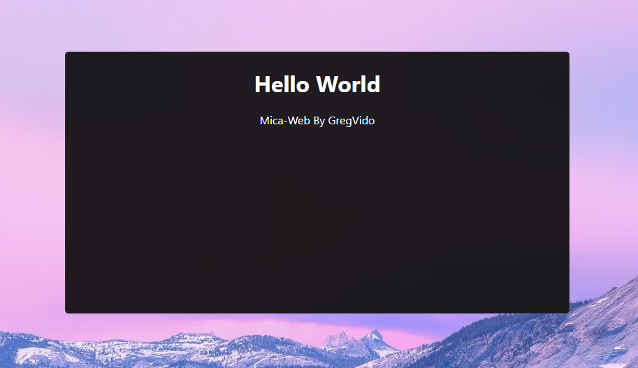

<h1 align=center>Mica-Web</h1>
<div align=center>
<br>
<b>Mica-Web</b> is a tool to add mica effect on a website.<br>
This is created by <a href="https://www.youtube.com/gregvido">GregVido</a>.

</div>

<h2>Usage</h2>

To use <b>Mica-Web</b>, you must include the <a href="mica.js">mica.js</a> script in your HTML file like this :

```html
<script src="./mica.js"></script>
```

After adding script, add a class in your element to apply the mica effect.<br>
Exemple:

```html
<div class="mica draggable border">
    <h1>Hello World</h1>
    <p>Mica-Web By GregVido</p>
</div>
```

The `mica` keyword applies the mica effect, `draggable` activates window displacement, and `border` applies windows 11 border to the element.

You can replace the keyword `mica` with `acrylic` to have an acrylic background.


Default, the theme is light, but if you want to force dark theme, add `theme-dark` to body like this :

```html
<body class="theme-dark" data-mica-url="./wallpaper.jpg">
```
<b>The `data-mica-url` attribute is very important.</b><br>

<h2>Exemple</h2>

You can see <a href="exemple/">exemple</a> here.